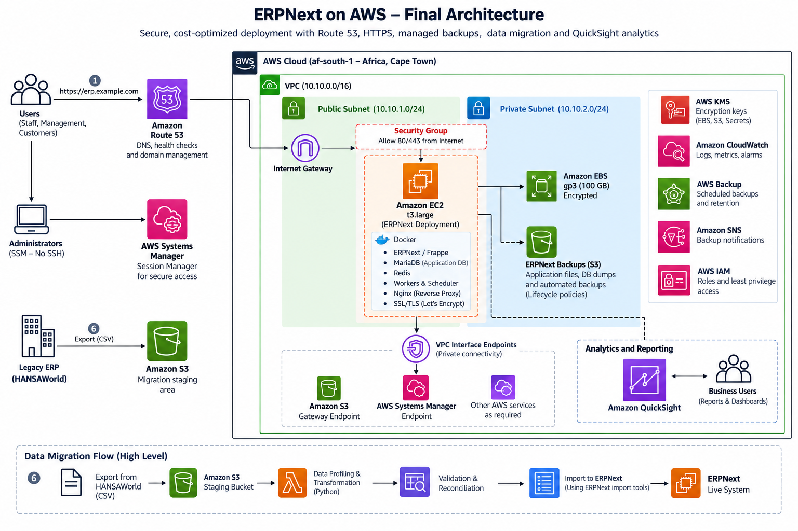

# ERPNext on AWS
## Enterprise ERP Modernization, Data Migration & Cloud Architecture

A production-oriented AWS architecture and implementation project demonstrating the modernization of a legacy enterprise resource planning (ERP) environment through ERPNext deployment, structured data migration, cloud security, operational resilience, and business intelligence integration.

The project covers the architecture, deployment, validation, and operational considerations involved in transitioning from an on-premises ERP environment to an AWS-hosted ERPNext platform.


## 1. Project Overview

Enterprise ERP modernization involves more than deploying an application in the cloud. It requires careful consideration of infrastructure architecture, data integrity, application dependencies, security, availability, operational management, and long-term scalability.

This project implements ERPNext on AWS using a Dockerized application stack hosted on Amazon EC2.

The architecture incorporates:

- Amazon VPC networking and security controls.
- Amazon Route 53 for DNS management.
- Amazon EC2 for application and database hosting.
- Docker-based ERPNext application deployment.
- Amazon EBS for persistent storage.
- AWS Systems Manager for secure administration.
- Amazon CloudWatch for monitoring and observability.
- AWS Backup and Amazon S3 for data protection.
- AWS Key Management Service (KMS) for encryption.
- Amazon QuickSight for business intelligence and reporting.

The implementation also demonstrates a structured migration workflow for transferring legacy ERP records into ERPNext.

The initial architecture uses a single EC2 instance in accordance with the project's deployment requirements, with a documented recovery strategy and a defined path toward a distributed, highly available architecture.


## 2. Solution Architecture



**AWS Region:** Africa (Cape Town) — `af-south-1`

The solution deploys ERPNext within an Amazon VPC, with the application hosted on an EC2 t3.large instance.

Amazon Route 53 manages DNS resolution, while an Nginx reverse proxy provides HTTPS ingress to the ERPNext application.

The Dockerized environment contains ERPNext/Frappe, MariaDB, Redis, background workers, and the application scheduler.

Persistent application and database data reside on encrypted Amazon EBS storage.

AWS Systems Manager provides administrative access without requiring publicly exposed SSH access.

Amazon CloudWatch supports infrastructure and application monitoring, while AWS Backup and Amazon S3 provide complementary data protection mechanisms.

Amazon QuickSight enables business reporting through controlled access to approved ERPNext reporting datasets.

### Architecture Principles

The solution is designed around the following principles:

1. Security by design and least-privilege access.
2. Persistent storage independent of container lifecycles.
3. Controlled and auditable data migration.
4. Operational visibility and recoverability.
5. Separation of transactional and analytical workloads where practical.
6. Documented architectural trade-offs.
7. A clear evolution path toward independent scaling and high availability.


## 3. AWS Infrastructure

| Architecture Layer | AWS Service / Technology | Purpose |
|---|---|---|
| Region | Africa (Cape Town) | Regional deployment |
| Networking | Amazon VPC | Network isolation and routing |
| DNS | Amazon Route 53 | Domain management and DNS resolution |
| Compute | Amazon EC2 t3.large | ERPNext application hosting |
| Containerization | Docker | Application and service deployment |
| Database | MariaDB | Transactional ERP data |
| Cache and queues | Redis | Caching and background job coordination |
| Storage | Amazon EBS gp3 | Persistent application and database storage |
| Migration staging | Amazon S3 | Temporary storage of legacy data exports |
| Backup storage | Amazon S3 | ERPNext application and database backups |
| Infrastructure backup | AWS Backup | Backup policies and recovery points |
| Encryption | AWS KMS | Encryption key management |
| Administration | AWS Systems Manager | Secure instance access and management |
| Monitoring | Amazon CloudWatch | Metrics, logs, and alarms |
| Access control | AWS IAM | Least-privilege AWS permissions |
| Analytics | Amazon QuickSight | Business dashboards and reporting |

### EC2 Configuration

| Parameter | Configuration |
|---|---|
| Instance type | t3.large |
| vCPU | 2 |
| Memory | 8 GiB |
| Operating system | Ubuntu Linux |
| Storage | 100 GB gp3 EBS |
| Deployment model | Dockerized ERPNext |
| Administrative access | AWS Systems Manager Session Manager |

The EC2 instance hosts the application and its supporting services within a single compute environment.


## 4. Application Architecture

ERPNext is deployed using Docker, with separate containers for the application and supporting services.

The application stack includes:

- ERPNext and Frappe Framework.
- MariaDB database.
- Redis services.
- Background workers.
- Scheduler.
- Nginx reverse proxy.

Docker provides consistent application packaging, service configuration, and deployment procedures.

Persistent data is maintained on EBS-backed storage to preserve database records and application files across container recreation.

Internal database and Redis ports are restricted from public internet access.


## 5. Database Architecture Decision

### MariaDB on EC2

The initial architecture hosts MariaDB alongside ERPNext on the same EC2 instance rather than provisioning a separate Amazon RDS database.

This decision reflects the initial deployment requirements and the objective of maintaining a consolidated application environment.

It also allows the ERPNext application and database services to be deployed and managed as a coordinated Docker stack.

### Architectural Trade-offs

The implementation assumes responsibility for database administration, monitoring, patching, backup configuration, and recovery.

Application and database workloads share the same compute resources and failure domain.

A failure affecting the EC2 instance may therefore affect both application and database availability.

### Future Database Evolution

As workload requirements increase, MariaDB can be migrated to Amazon RDS to provide:

- Independent database resource scaling.
- Managed database operations.
- Automated database backups.
- Improved separation of application and database workloads.
- A path toward Multi-AZ database availability.

The initial database decision is specific to the project requirements and does not represent a general preference for self-managed databases over managed database services.


## 6. Network Architecture and Security

The environment is deployed within an Amazon VPC with defined subnet boundaries, routing, and security controls.

### Network Design

- Public subnet for the initial EC2-hosted application.
- Internet Gateway for required internet connectivity.
- Security groups restricting inbound and outbound traffic.
- HTTPS access through the application reverse proxy.
- Private subnet allocation for future architectural separation.
- VPC endpoints where appropriate for private access to supported AWS services.

### Administrative Access

AWS Systems Manager Session Manager provides secure administrative access to the EC2 instance.

Public SSH access is excluded from the intended operating configuration.

### Security Controls

The implementation includes:

- Least-privilege IAM permissions.
- Encrypted EBS storage.
- AWS KMS key management.
- Restricted application and database ports.
- Controlled handling of credentials and secrets.
- HTTPS for application access.
- Operating system and application patching.
- Logging and monitoring through CloudWatch.

MariaDB, Redis, and internal application ports must remain inaccessible from the public internet.


## 7. Legacy ERP Data Migration

The project demonstrates a structured migration from a simulated legacy ERP environment to ERPNext.

Synthetic HANSAWorld-style data is used to demonstrate the migration workflow without exposing client information.

### Migration Workflow
```
Legacy ERP Export

↓

CSV Data Extraction

↓

Amazon S3 Migration Staging

↓

Data Profiling and Quality Assessment

↓

Data Cleaning and Transformation

↓

Source-to-Target Field Mapping

↓

Validation and Reconciliation

↓

ERPNext Data Import / Frappe API

↓

ERPNext MariaDB
```
### Migration Activities

The implementation covers:

1. Identifying source data entities and dependencies.
2. Exporting representative legacy records.
3. Preserving raw CSV files during migration.
4. Profiling source data for quality issues.
5. Mapping legacy fields to ERPNext DocTypes.
6. Transforming data into ERPNext-compatible formats.
7. Validating required fields and relationships.
8. Importing records through supported ERPNext interfaces.
9. Reconciling source and destination records.
10. Documenting rejected records and migration findings.

Direct database inserts will be avoided where they bypass ERPNext application validation and business logic.

Temporary migration staging data will be removed or retained according to the agreed migration retention policy.


## 8. Amazon QuickSight Integration

Amazon QuickSight provides managed business intelligence and reporting for ERPNext.

The integration uses approved reporting datasets and restricted read-only database access to support operational and management dashboards.

SPICE will be evaluated to cache analytical datasets and reduce repeated reporting queries against the production MariaDB database.

The reporting architecture will prioritize controlled access to business data and minimize the impact of analytical workloads on transactional ERP operations.


## 9. Observability and Operations

Amazon CloudWatch provides operational visibility across the EC2 environment and application stack.

Monitoring will cover:

- EC2 CPU utilization.
- Memory utilization.
- Disk utilization.
- Application and system logs.
- Container and service health.
- Database health.
- Relevant operational alarms.

The implementation will document monitoring configuration, alarm thresholds, and operational response procedures.


## 10. Backup, Recovery and Availability

The initial deployment uses a single EC2 instance.

Consequently, the application and database share a common compute failure domain, and the architecture does not provide multi-instance high availability.

The solution instead implements a recovery-focused operational model.

### Data Protection

The backup strategy incorporates:

- AWS Backup for selected infrastructure recovery points.
- ERPNext application and database backups.
- Amazon S3 for backup storage.
- Defined retention and encryption controls.
- Documented restoration procedures.

### Recovery Validation

Recovery procedures will be tested to establish that application and database services can be restored from the selected backup mechanisms.

Recovery Time Objective (RTO) and Recovery Point Objective (RPO) will be defined based on business requirements.

Backup completion alone will not be treated as evidence of successful recoverability.


## 11. Scalability and Architecture Evolution

The initial deployment establishes a foundation for future architectural expansion.

### Phase 1 — Consolidated Deployment

ERPNext, MariaDB, Redis, and supporting services operate on a single EC2 instance.

### Phase 2 — Independent Resource Scaling

Increase compute capacity where justified and evaluate migration of MariaDB to Amazon RDS.

### Phase 3 — Application High Availability

Introduce multiple ERPNext application instances across Availability Zones behind an Application Load Balancer.

This phase will require appropriate handling of shared application files, session state, Redis, background workers, and database connectivity.

### Phase 4 — Managed Database Availability

Evaluate an appropriate Amazon RDS Multi-AZ deployment to support managed database failover and improved database resilience.

The transition between phases will be driven by measured utilization, operational requirements, and agreed availability objectives.


## 12. Cost and Resource Optimization

Cost optimization is considered alongside security, reliability, performance, and operational requirements.

The initial environment uses EC2 On-Demand pricing to maintain flexibility during deployment and workload validation.

After stabilization, a one-year EC2 Instance Savings Plan may be evaluated based on the confirmed instance configuration and expected utilization.

Temporary migration resources will be reviewed and removed when no longer required.

Infrastructure cost estimates are documented separately from the architecture and implementation evidence.


## 13. Repository Structure

```text
aws-erpnext-modernization/
├── README.md
├── .gitignore
├── docs/
│   ├── 01-business-requirements.md
│   ├── 02-architecture-decisions.md
│   ├── 03-implementation-plan.md
│   ├── 04-cost-analysis.md
│   ├── 05-security-and-recovery.md
│   └── architecture/
│       └── ERPNext_to_AWS_Architecture.png
├── infrastructure/
├── deployment/
│   ├── docker/
│   └── scripts/
├── migration/
│   ├── sample-data/
│   ├── mappings/
│   ├── scripts/
│   └── validation/
├── analytics/
│   ├── sql/
│   └── dashboards/
├── tests/
└── evidence/
```


## 14. Implementation Roadmap

| Milestone | Implementation Area | Status |
|---|---|---|
| 01 | Project foundation and architecture documentation | In progress |
| 02 | AWS networking and infrastructure | Planned |
| 03 | EC2 configuration and Docker deployment | Planned |
| 04 | ERPNext application configuration | Planned |
| 05 | Legacy ERP data migration | Planned |
| 06 | QuickSight integration | Planned |
| 07 | Monitoring, security, and backup configuration | Planned |
| 08 | Recovery and performance validation | Planned |
| 09 | Architecture review and portfolio documentation | Planned |

Implementation results, technical decisions, configuration changes, and validation evidence will be documented as the project progresses.


## 15. Project Data and Confidentiality

This repository is intended for public technical documentation and portfolio demonstration.

The implementation uses synthetic data and sanitized technical evidence.

Production customer records, credentials, secrets, confidential financial data, private infrastructure identifiers, and database backups must remain outside the public repository.


## Project Status

**Current phase: Architecture and project foundation.**

The architecture represents the intended target design. Individual services will be documented as implemented only after deployment and validation.
